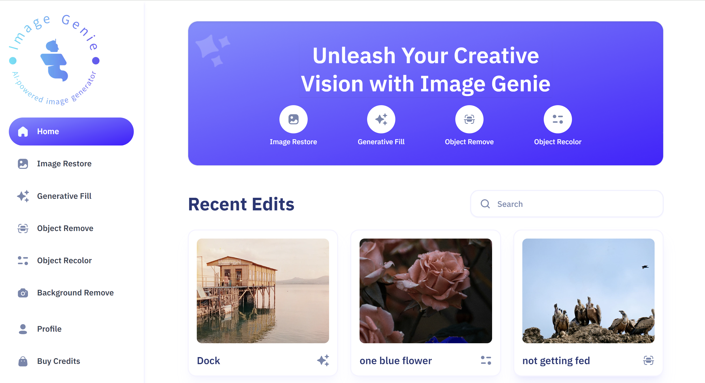

# Image Genie

### [Live Site](https://image-genie.vercel.app/)

---

## Description

Image Genie is an AI image SaaS platform that excels in image processing capabilities, integrates a secure payment infrastructure, offers advanced image search functionalities, and supports multiple AI features, including image restoration, recoloring, object removal, generative filling, and background removal.

---

## Built With

- Next.js
- TypeScript
- MongoDB
- Clerk
- Cloudinary
- Stripe
- Shadcn
- TailwindCSS

---

## <a name="features">🔋 Features</a>

👉 **Authentication and Authorization**: Secure user access with registration, login, and route protection.

👉 **Community Image Showcase**: Explore user transformations with easy navigation using pagination

👉 **Advanced Image Search**: Find images by content or objects present inside the image quickly and accurately

👉 **Image Restoration**: Revive old or damaged images effortlessly

👉 **Image Recoloring**: Customize images by replacing objects with desired colors easily

👉 **Image Generative Fill**: Fill in missing areas of images seamlessly

👉 **Object Removal**: Clean up images by removing unwanted objects with precision

👉 **Background Removal**: Extract objects from backgrounds with ease

👉 **Download Transformed Images**: Save and share AI-transformed images conveniently

👉 **Transformed Image Details**: View details of transformations for each image

👉 **Transformation Management**: Control over deletion and updates of transformations

👉 **Credits System**: Earn or purchase credits for image transformations

👉 **Profile Page**: Access transformed images and credit information personally

👉 **Credits Purchase**: Securely buy credits via Stripe for uninterrupted use

👉 **Responsive UI/UX**: A seamless experience across devices with a user-friendly interface

and many more, including code architecture and reusability 
       
## Contact

  <a href="https://robsimmons.netlify.app/](https://robsimmons.netlify.app/">
    
  
  
  <a href="https://github.com/rsimmons11">
    

---

## Acknowledgments

Inspiration, code snippets, etc.
* [adrianhajdin](https://github.com/adrianhajdin)
* [awesome-readme](https://github.com/matiassingers/awesome-readme)
* [readme-template](https://gist.github.com/DomPizzie/7a5ff55ffa9081f2de27c315f5018afc)
* [dbader](https://github.com/dbader/readme-template)
* [zenorocha](https://gist.github.com/zenorocha/4526327)

